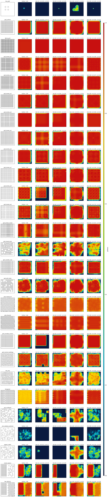

# gridness

A library for scoring how "grid-like" each region of a 2D city layout is.
Given a raster of walls (1 = wall, 0 = empty), it produces a smooth
heatmap where high values mean the local neighborhood looks like a
regular grid (rows of aligned, similarly-sized buildings) and low values
mean it looks organic, scattered, or unaligned.

Two implementations live in this repo:

- **Java** (`java/`) — the production library. Incremental: `setPixel`,
  `unsetPixel`, and `applyBatch` keep an internal cache live so a
  single-cell edit costs a few milliseconds on a 768×768 field, not a
  full recompute. Intended for live tools and game engines.
- **Python** (`src/gridness/`) — the reference prototype. Slower,
  recomputes from scratch, but the algorithm is shorter and easier to
  read. Used as the visual ground truth the Java side is tuned against.

Both implementations agree on the algorithm and produce visually
comparable heatmaps over the 27-layout fixture set. The Java defaults
match Python with mean L1 ≈ 0.11 per pixel (heatmap values are in
`[0, 1]`).



> The figure above shows, for each of 27 synthetic layouts, the gridness
> heatmap with walls overlaid in black: Python reference vs the three
> Java presets (fast, balanced — default, high fidelity).

---

## Quick start (Java)

```java
import com.dkorduban.gridness.Gridness;
import com.dkorduban.gridness.GridnessParams;

// 768x768 field. Defaults are tile=128 stride=128 hpw=45 — a good
// match for the Python reference; see "Parameters" for tuning.
Gridness g = new Gridness(768, 768, GridnessParams.defaults());

// Initial fill: bulk-load the wall raster.
boolean[][] walls = ...;          // [y][x]
g.loadFromField(walls);

// Read one sample (forces lazy recompute of dirty tiles).
double v = g.valueAt(384, 384);   // in [0, 1]

// Read the full heatmap at sampleStride spacing.
double[][] heat = g.readRect(0, 0, 768, 768);

// Live edits — mark dirty, do not recompute until next valueAt/readRect.
g.setPixel(100, 200);
g.unsetPixel(101, 200);

// Batch edit — much cheaper than N setPixel calls when N is large.
int[] xs = {100, 101, 102};
int[] ys = {200, 200, 200};
boolean[] setOrUnset = {true, true, true};
g.applyBatch(xs, ys, setOrUnset, /*strict=*/false);
```

## Quick start (Python)

```python
import numpy as np
from gridness.extract import extract_buildings
from gridness.scoring.v3_hough import V3Params, score_map_v3

raster = np.load("city.npy").astype(bool)        # H x W, True = wall
buildings = extract_buildings(raster, min_area=4)
result = score_map_v3(buildings, raster.shape, V3Params(), raster=raster)
heatmap = result["gridness"]                     # H' x W' (strided)
```

## Live viewer

JDK-only Swing viewer with build / dismantle simulation and a fused
walls + heatmap overlay:

```bash
cd java
source env.sh                     # sets JAVA_HOME + PATH for the bundled toolchain
gradle viewer --args="--fixture city_768 --mode cycle"
```

Headless snapshot (writes a PNG):

```bash
gradle viewer --args="--snapshot out.png --ticks 600 --fixture city_768"
```

---

## What "gridness" means here

Most cells in a wall-grid game sit on a square tile lattice, so raw
wall-orientation histograms see lots of 0°/90° edges even in
totally-organic mazes. They are not a useful signal.

The signal that *does* discriminate "London" from "Manhattan" is:

> **Can the buildings in this neighborhood be explained by a small
> shared set of row/column lines?**

If you can pick a few horizontal and a few vertical lines such that
every building snaps to them, the area looks grid-like. If you need a
new line for each building, it doesn't.

That is what this library scores, per-pixel, with a Gaussian-weighted
local window.

---

## Algorithm

For each sample point `p` with a radius-`R` window around it, compute:

1. **Extract buildings**. Flood-fill the empty space from the field
   boundary (4-connected); enclosed empty components are building
   interiors. Dilate by 1 to include the surrounding wall shell. The
   Java side does this per-tile with a small read-padding, backed by an
   incremental global exterior bitmap.
2. **Find dominant wall directions** with a per-tile Hough transform
   over the wall raster. Keep up to `houghNumPeaks` directions whose
   accumulator weight exceeds `houghMinPeakWeight`. Merge peaks closer
   than `houghMinAngleSepDeg` (so a 0° and a 179° peak count once).
3. **Build candidate frames** as all pairs of those wall directions
   `(a, b)` whose intersection angle is not too shallow
   (`|sin(a, b)| ≥ minAngleSin`, i.e. not too parallel).
4. **Project boundaries** of each building in the window onto `a` and
   `b` to get its 1D extents (min, max, optionally a percentile clip).
5. **1D-cluster** the projected extents along `a` and along `b`. A
   cluster captures buildings that snap to the same line. Compute a
   score per axis that combines:
   - `explained_mass` — what fraction of buildings landed in a cluster,
   - `cluster_count_score` — how many clusters cleared
     `requiredLinesPerAxis`,
   - `tightness` — how tightly buildings sit within their cluster
     (1 − mean residual / `clusterTolerance`).
6. **Frame score** = `√(u_score · v_score) · √(cluster_count_u ·
   cluster_count_v)`. The square roots make the score symmetric in the
   two axes and quadratically penalize a frame that is good on only one
   axis.
7. **Sample score** = `max` over all candidate frames, optionally
   blended with a small rectangular-shape adjustment
   (`shapeFloor / shapeWeight`).
8. **Aggregate to a heatmap** by Gaussian-weighting all buildings within
   radius `R` of the sample (σ = `sigmaFrac · R`) and scoring on each
   `sampleStride × sampleStride` block. The final per-pixel heatmap is
   bilinearly interpolated from the sample grid.

The detailed flow in the Java implementation is:

```
edit (setPixel / applyBatch)
   → mark affected tiles dirty
   → mark affected samples dirty
   → (lazy) on next valueAt:
        recompute exterior bitmap if dirty
        recompute Hough peaks per dirty tile
        re-extract buildings in dirty tiles
        re-score dirty samples by ForkJoin'd parallel iteration
        bilinear-interpolate to the requested (x, y)
```

The whole pipeline is event-driven: nothing recomputes until a sample
is actually read.

### Why incremental?

A single wall edit only affects:
- the tiles whose `extractionPad`-padded read region covers that cell
  (typically 1, sometimes 2×2 = 4 with the default zero-overlap tiling),
- the samples whose radius-`R` window covers any of those tiles.

`ensureClean()` only touches the dirty set. That is why a single
`setPixel` on a 768² field costs ~1.5 ms instead of ~13 ms for a
full-rebuild.

---

## High-level architecture

```
┌──────────────────────────────────────────────────────────────────────┐
│                          public  Gridness                            │
│  setPixel/unsetPixel/applyBatch ─┐         ┌── valueAt / readRect    │
│             loadFromField        │         │                         │
└─────────────────────────────────┬┴─────────┴─────────────────────────┘
                                  │
        ┌──────────── ensureClean (lazy, on read) ────────────┐
        ▼                          ▼                          ▼
   ExteriorBitmap            HoughDetector              Tile (per-tile)
   (incremental,             (per-tile +              ┌─ Hough peaks
    global flood)             optional global) ─────► ├─ buildings
                                                      └─ scored frame
                                                              │
                                                              ▼
                                                       SampleGrid
                                                       (Gaussian-weighted
                                                        per-tile score)
                                                              │
                                                              ▼
                                                       heatmap[ny][nx]
                                                       (bilinear interp
                                                        on read)
```

Concrete files (`java/src/main/java/com/dkorduban/gridness/`):

| Class | What it does |
|---|---|
| `Gridness` | public façade; tracks dirty sets, schedules recompute |
| `GridnessParams` | immutable config + Builder |
| `WallGrid` | dense `boolean[][]` walls, no extra logic |
| `internal/TileGrid` | tile geometry helpers (col/row/origin lookups) |
| `internal/Tile` | one tile's buildings, Hough peaks, last score |
| `internal/SampleGrid` | sample positions + per-sample scoring |
| `internal/ExteriorBitmap` | incremental "is this cell reachable from the field boundary by 4-conn empty path" |
| `internal/HoughDetector` | per-tile Hough accumulator + peak finder |
| `internal/GlobalHough` | optional whole-field Hough (matches Python reference) |
| `internal/BuildingExtractor` | flood-fill → enclosed interiors → boundary cells |
| `internal/Cluster1D` | 1D extents → clusters → axis score |
| `internal/FrameScorer` | combine u/v axis scores into a frame score |
| `viz/GridnessViewer` | Swing live viewer (fused walls + heatmap) |
| `viz/HeatmapDumper` | CLI that writes text heatmaps for `scripts/compare_*.py` |
| `sim/BuildSim` | reusable build / dismantle simulator (also used by JMH) |

---

## Parameters

All knobs live on `GridnessParams`. Build with the `Builder`:

```java
GridnessParams.builder()
    .tileSize(128).tileStride(128)
    .houghMinPeakWeight(45)
    .build();
```

### Window / resolution

| Param | Default | What it controls | Tuning |
|---|---:|---|---|
| `tileSize` | 128 | side length of a tile (the unit of incremental recomputation) | Bigger = better Python match, more cost per edit; smaller = cheap edits, noisier Hough. See benchmarks. |
| `tileStride` | 128 | distance between tile origins | Equal to `tileSize` means no overlap (default). Half = 50 % overlap, smoother boundaries, 4× cost. |
| `sampleStride` | 8 | spacing between sample points in pixels | Heatmap resolution is `(W / s) × (H / s)`. 8 is a good default; 4 is sharper but 4× the per-sample work. |
| `radius` | 30.0 | radius of the per-sample Gaussian window (pixels) | Roughly "how many neighbors a sample considers." 30 ≈ 4 typical buildings. Lower = more local, more spatial detail; higher = smoother. |
| `sigmaFrac` | 0.5 | Gaussian σ as a fraction of `radius` | Smaller = sharper local weighting; larger = more global. 0.5 is the canonical Mexican-hat-like choice. |
| `interpolation` | BILINEAR | NEAREST or BILINEAR sampling between sample grid points | NEAREST shows tile artefacts at low `sampleStride`; BILINEAR hides them. |

### Hough peak detection

| Param | Default | What it controls | Tuning |
|---|---:|---|---|
| `houghThetaSteps` | 90 | number of angle bins in `[0°, 180°)` | More = finer angle resolution, ~linear cost. 90 = 2° bins is plenty. |
| `houghNumPeaks` | 8 | max wall directions kept per tile | More = catch more grid directions; rarely needed > 4 for true grids. |
| `houghThresholdFrac` | 0.05 | reject peaks below this fraction of the strongest peak | Relative noise floor. Tighten if a tile picks up junk angles. |
| **`houghMinPeakWeight`** | **45** | absolute min accumulator weight for a peak | The single most important knob. Roughly the minimum line-length a peak must represent. Scales with `tileSize` (a perfect line of length T contributes ≈ T votes). |
| `houghMinAngleSepDeg` | 5.0 | merge peaks closer than this | 0° and 178° should be one peak — set 5–10°. |

`houghMinPeakWeight` is the false-positive control. Too low and
scattered organic layouts pick up chance line alignments → spurious
high gridness. Too high and rotated / sheared grids lose their support
lines → spurious low gridness. The transition is sharp (cliff between
~38 and ~50 at `tileSize=128`), so tune carefully.

### Frame validity / scoring

| Param | Default | What it controls | Tuning |
|---|---:|---|---|
| `minAngleSin` | 0.34 | reject frames whose two axes are too parallel (`\|sin\| < 0.34` ≈ 20° apart) | Prevents `(0°, 5°)` from masquerading as an orthogonal frame. |
| `clusterTolerance` | 2.5 | max distance from a cluster center for a building to "snap" (pixels) | Wider = more tolerant of misaligned grids; tighter = stricter. |
| `minDistinctBuildings` | 2 | a cluster needs at least this many distinct buildings to count | Reject 1-building clusters (every isolated building creates a 1-cluster). |
| `requiredLinesPerAxis` | 3 | clusters needed per axis for full credit | Below this `cluster_count_score < 1`. |
| `minBuildingsInWindow` | 2 | reject sample windows with fewer buildings | Empty / near-empty areas → score 0. |
| `minBuildingArea` | 4 | reject buildings smaller than this many interior cells | Filters single-cell walls and 1×1 buildings. |

### Shape adjustment

| Param | Default | What it controls |
|---|---:|---|
| `shapeFloor` | 0.85 | minimum shape multiplier (so non-rectangular buildings don't zero the score) |
| `shapeWeight` | 0.15 | weight of the rectangularity term |

A 100 % rectangular building gets multiplier 1.0; a fully irregular
building gets `shapeFloor`. The default is intentionally weak — layout
gridness dominates shape gridness (cf. `grid_nonrect_buildings` in the
fixture set).

### Extraction / runtime

| Param | Default | What it controls | Tuning |
|---|---:|---|---|
| `extractionPad` | 4 | cells of extra read margin around each tile for the local flood-fill | Bump if you have buildings larger than `2 × extractionPad` cells across (otherwise they "leak" the local exterior and are silently skipped). |
| `boundaryClipPercentile` | 0.0 | percentile clip on projected building extents (0.0 = min/max; 0.05 = 5th/95th) | 0.05 matches the Python prototype and helps on non-rectangular layouts (e.g., hexagonal). 0.0 is the cheap default. |
| `useGlobalHough` | false | use one whole-field Hough instead of per-tile Hough | Matches Python exactly; adds ~50 µs/edit. Mostly useful for closer Python parity, rarely worth it in production. |
| `parallel` | true | use the `ForkJoinPool.commonPool()` for tile + sample recompute | Turn off for deterministic single-threaded runs. |

### Named presets

- **`fast`** — `tileSize(32).tileStride(32).houghMinPeakWeight(18)`. ~3×
  faster per single-cell edit but slightly noisier and gets some false
  positives on scattered layouts.
- **`balanced`** *(default — `GridnessParams.defaults()`)* —
  `tileSize=128 hpw=45`. Best Python match while staying under ~1.5 ms
  per single-cell edit on 768².
- **`high fidelity`** — `tileSize(256).tileStride(256)
  .houghMinPeakWeight(30).boundaryClipPercentile(0.05)
  .useGlobalHough(true)`. Closest to Python (mean L1 ≈ 0.08); too slow
  for live editing but fine for offline analysis.

---

## Java API

Constructor:

```java
new Gridness(int width, int height, GridnessParams params)
```

Reads:

```java
double valueAt(int x, int y);                     // single sample, [0, 1]
double[][] readRect(int x1, int y1, int x2, int y2);  // strided heatmap
boolean isWall(int x, int y);
int width();
int height();
GridnessParams params();
```

Edits — single cell:

```java
void setPixel(int x, int y);     // x,y becomes a wall
void unsetPixel(int x, int y);   // x,y becomes empty
```

Edits — batch:

```java
void applyBatch(int[] xs, int[] ys, boolean[] setOrUnset, boolean strict);
void applyBatch(int[] xs, int[] ys, boolean[] setOrUnset, int n, boolean strict);
```

`strict=true` throws on conflicting ops at the same `(x, y)` within one
batch; `strict=false` silently keeps the last write. The `n`-arg
overload uses only the first `n` entries of each array so callers can
reuse preallocated max-size buffers.

Bulk load:

```java
void loadFromField(boolean[][] field);   // [y][x]; marks every tile dirty
```

Diagnostics:

```java
int dirtyTileCount();
int dirtySampleCount();
int tileCount();
int tileCols();
int tileRows();
int sampleCount();
```

### Behavior contract

- Reads are lazy. `valueAt` / `readRect` call `ensureClean()` internally,
  which recomputes only the dirty subset.
- Edits are O(affected tiles × tile area) for tile recompute, plus an
  amortized incremental exterior update. A single edit on a fresh
  `Gridness(768, 768, defaults())` averages **~1.5 ms**.
- `applyBatch` collapses duplicate cells via an open-addressed hash and
  switches from N small incremental exterior updates to one global
  recompute when more than ~8 distinct cells flip. This keeps a 30-cell
  build tick comfortably under 5 ms on a 768² field.
- `loadFromField` is destructive: it bulk-overwrites the wall grid and
  marks **everything** dirty. The next read re-extracts every building
  and re-scores every sample.
- Not thread-safe — the Java side uses `ForkJoinPool.commonPool()`
  internally for parallel tile / sample recompute, but only one thread
  may call `Gridness` methods at a time.

---

## Python API

```python
from gridness.extract import extract_buildings
from gridness.scoring.v3_hough import V3Params, score_map_v3
from gridness.scoring.v1_axis import score_map_v1  # axis-aligned only
from gridness.scoring.v2_affine import score_map_v2  # exhaustive frame sweep
```

`extract_buildings(raster: np.ndarray, min_area: int = 4)
  → list[Building]`

`score_map_vN(buildings, shape, params=V*Params(), raster=...)
  → {"gridness": np.ndarray, "rowness": ..., "shape": ..., "confidence": ...,
      "stride": int, "algo": str}`

V3 is the recommended algorithm (it is what the Java side mirrors).
V1 is axis-aligned-only (broken on rotated/sheared); V2 is the
exhaustive frame sweep (slower, less robust than V3). They are kept for
historical comparison.

The Python prototype is intentionally inefficient — it recomputes from
scratch on every call. For a live tool, use the Java side.

---

## Benchmarks

JMH, JDK 21, WSL2, on a 13th Gen Intel Core i9-13900H @ 2.60 GHz.
2 × 3 s warmup, 3 × 3 s measurement, fork 1. "Build tick" =
`applyBatch` of ~30 cells (3 in-progress buildings × ~10 workers each)
+ a forced `valueAt` to drive `ensureClean`.

### `balanced` preset — default (`tileSize=128 hpw=45`)

| Benchmark | grid_uniform_256 | longhouses_22x100 | four_districts_512 | city_768 |
|---|---:|---:|---:|---:|
| `singlePixelOnClean` | 1.19 ms | — | — | **1.54 ms** |
| `buildTick` | 1.42 ms | 1.15 ms | 2.52 ms | **4.43 ms** |
| `dismantleTick` | 1.51 ms | 1.10 ms | 2.65 ms | **4.81 ms** |
| `fromScratch` | 2.09 ms | 1.57 ms | 4.55 ms | 13.48 ms |

### `fast` preset (`tileSize=32 hpw=18`)

| Benchmark | grid_uniform_256 | longhouses_22x100 | four_districts_512 | city_768 |
|---|---:|---:|---:|---:|
| `singlePixelOnClean` | — | — | — | 0.51 ms |
| `buildTick` | — | — | — | 3.86 ms |
| `dismantleTick` | — | — | — | 3.56 ms |

### Match quality vs Python (mean L1 over 27 fixtures, heatmap in [0,1])

| Config | mean L1 |
|---|---:|
| `fast` — `tileSize=32 hpw=18` | 0.123 |
| **`balanced` — `tileSize=128 hpw=45` (default)** | **0.108** |
| `high fidelity` — `tileSize=256 hpw=30` | 0.080 |

The balanced default trades ~3× per-edit cost over `fast` for the best
per-pixel agreement with the Python reference and removes the false-positive
hotspots on scattered/organic layouts (e.g. `rect_scattered`,
`organic_walks`). The full sweep is in
`scripts/sweep_java_params.py`; older numbers and per-cell breakdown
in [`java/BENCHMARK.md`](java/BENCHMARK.md).

### Reproducing

```bash
cd java
source env.sh

# JMH at defaults:
gradle :jmh

# JMH at the old "gold" tile=256 matching config (for A/B):
gradle :jmh -PmatchingConfig=true
```

---

## Build & test

### Java

Requires JDK 21 + Gradle 8. The `java/env.sh` script puts the bundled
JDK + Gradle (under `~/jdk` and `~/tools` on the dev machine) on
`PATH`; adapt it for your environment.

```bash
cd java
source env.sh

gradle build          # compile + run all tests
gradle test           # tests only
gradle :jmh           # JMH benchmarks (~5 min)
gradle :viewer        # Swing live viewer
gradle :dumpHeatmaps  # CLI: dump per-layout heatmaps for the compare scripts
```

### Python

Requires Python ≥ 3.12 and [`uv`](https://github.com/astral-sh/uv).

```bash
uv sync               # install deps into .venv

# generate the synthetic dataset (deterministic, seed=0)
uv run python -m scripts.generate_dataset

# render the Python ↔ Java comparison figure
uv run python -m scripts.compare_four_cols

# run the full Python eval (writes experiments/<id>/...)
uv run python -m scripts.run_experiment --algo v3 --tag baseline

# tune Java parameters against Python (writes data/layouts_heatmaps_java_sweep/)
uv run python -m scripts.sweep_java_params
```

---

## Repository layout

```
gridness/
├── README.md                ← this file
├── LICENSE                  ← Apache 2.0
├── NOTICE                   ← attribution required on redistribution
├── PROBLEM.md               ← original problem statement (read-only)
├── REPORT.md                ← Python prototype findings (long)
├── CLAUDE.md                ← autonomous-dev rules used to build this
├── pyproject.toml
│
├── java/
│   ├── env.sh               ← source to put JDK + Gradle on PATH
│   ├── build.gradle.kts
│   ├── BENCHMARK.md         ← detailed bench notes + per-cell normalization
│   └── src/{main,test,jmh}/java/com/dkorduban/gridness/
│
├── src/gridness/            ← Python reference implementation
│   ├── extract.py           ← flood-fill building extraction
│   ├── scoring/
│   │   ├── v1_axis.py       ← axis-aligned baseline
│   │   ├── v2_affine.py     ← exhaustive frame sweep
│   │   ├── v3_hough.py      ← Hough-derived frames (canonical)
│   │   └── common.py        ← shared clustering + Gaussian-weight code
│   ├── eval.py              ← experiment harness
│   ├── viz.py               ← matplotlib helpers
│   └── generate.py          ← synthetic dataset generator
│
├── scripts/
│   ├── generate_dataset.py
│   ├── run_experiment.py
│   ├── compare_four_cols.py ← fused walls + heatmap comparison figure
│   ├── sweep_java_params.py ← param sweep against the Python reference
│   └── …
│
├── data/
│   ├── fixtures_layouts/    ← 27 synthetic layouts (.txt + .buildings.txt)
│   ├── layouts_heatmaps_*/  ← cached heatmap dumps (gitignored variants)
│   └── comparison_grid_4cols.png
│
└── experiments/             ← per-run logs + figures (gitignored content)
```

---

## License & attribution

Apache License 2.0 — see [LICENSE](LICENSE). See [NOTICE](NOTICE) for attribution requirements.
